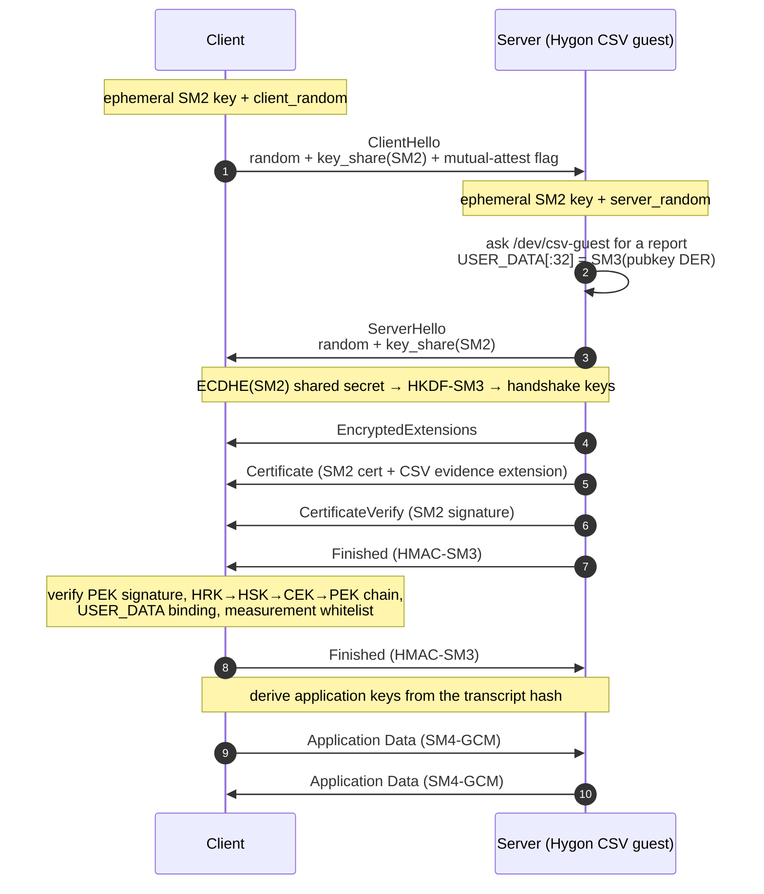

# teetls

> **TEE-TLS / RA-TLS transport for Go** — ShangMi cryptography + Hygon CSV remote
> attestation, exposed as a drop-in `net.Conn`, `net.Listener`, and `net/http` transport.

[](https://pkg.go.dev/github.com/CipherSlinger/teetls)
[](LICENSE)

`teetls` is a lightweight, pure-Go TEE-TLS / RA-TLS-style transport that combines ShangMi cryptography with Hygon CSV remote attestation.

It provides `net.Conn`, `net.Listener`, and `net/http` integration where an ephemeral SM2 certificate key is cryptographically bound to a CSV attestation report. The verifier checks the report signature, the Hygon certificate chain, the public-key binding in `USER_DATA`, and the configured measurement whitelist.

> Compatibility note: this project uses TLS 1.3 concepts and ShangMi primitives, but the current wire protocol is custom and interoperates with `teetls` peers. It should not be described as wire-compatible with arbitrary RFC 8446 / RFC 8998 TLS implementations unless a standard-compatible handshake is implemented separately.

---

## Contents

- [Features](#features)
- [Protocol Overview](#protocol-overview)
- [Trust Model and Key Separation](#trust-model-and-key-separation)
- [Offline Hygon Certificate Verification](#offline-hygon-certificate-verification)
- [Installation](#installation)
- [TCP Server Example](#tcp-server-example)
- [TCP Client Example](#tcp-client-example)
- [HTTP Client Integration](#http-client-integration)
- [Testing and Debugging Modes](#testing-and-debugging-modes)
- [Package Structure](#package-structure)
- [Common Commands](#common-commands)
- [Security Notes](#security-notes)

---

## Features

- **Pure Go**: no CGO or external C library dependency.
- **ShangMi primitives**:
  - SM2 ephemeral key agreement.
  - SM2 certificate signatures.
  - SM3 transcript, HMAC, HKDF, and public-key binding hashes.
  - SM4-GCM record encryption.
- **Hygon CSV remote attestation**:
  - CSV guest driver support in `pkg/csvattest` for `/dev/csv-guest` ioctls.
  - ASN.1/DER X.509 evidence extension (`1.3.6.1.4.1.58270.1.1`) carrying CSV reports and optional chain intermediates.
  - PEK signature verification over the report.
  - Hygon chain verification: trusted HRK -> HSK -> CEK -> PEK.
  - Public-key binding: report `USER_DATA[:32] == SM3(cert.RawSubjectPublicKeyInfo)`.
  - Measurement whitelist verification in strict mode.
- **Offline verification**:
  - Runtime verification does not require downloading Hygon certificates.
  - The HRK trust anchor must be embedded, pinned, or configured locally.
  - Peer-provided HRK material is not a trust anchor.
- **Mutual attestation**: optional bidirectional attestation where both endpoints present and verify evidence.
- **Go networking integration**: `Dial`, `Listen`, `NewHTTPTransport`, and `NewHTTPClient`.

---

## Protocol Overview

`teetls` runs a TLS 1.3-shaped handshake with ShangMi primitives: SM2 ephemeral key
agreement, an SM3 transcript, and SM4-GCM record protection. The CSV attestation is
**not** a separate packet or a custom record type — it is embedded as a DER-encoded
X.509 extension inside the ephemeral SM2 certificate, which travels inside the
encrypted `Certificate` handshake message. A sniffer therefore never sees an
"attestation" record: the evidence is hidden inside ordinary encrypted traffic.

### Handshake flow



### What Wireshark sees

Because TLS 1.3 hides the inner content type, only the two plaintext records
(`ClientHello`, `ServerHello`) reveal themselves as handshake traffic. Everything
after key derivation — including the `Certificate` that carries the CSV evidence —
shows up as generic **Application Data**.

```text
No.  Time       Source     Destination  Protocol  Length  Info
1    0.000000   10.0.0.2   10.0.0.1     TLSv1.3   161     Client Hello
2    0.000128   10.0.0.1   10.0.0.2     TLSv1.3   160     Server Hello
3    0.000133   10.0.0.1   10.0.0.2     TLSv1.3   81      Application Data (EncryptedExtensions)
4    0.000135   10.0.0.1   10.0.0.2     TLSv1.3   6801    Application Data (Certificate)   ★ CSV evidence
5    0.000136   10.0.0.1   10.0.0.2     TLSv1.3   152     Application Data (CertificateVerify)
6    0.000137   10.0.0.1   10.0.0.2     TLSv1.3   112     Application Data (Finished)
7    0.000141   10.0.0.2   10.0.0.1     TLSv1.3   112     Application Data (Finished)
8    0.000145   10.0.0.2   10.0.0.1     TLSv1.3   200     Application Data
9    0.000148   10.0.0.1   10.0.0.2     TLSv1.3   417     Application Data
```

Lengths are illustrative. Frame 4 is dominated by the attestation evidence: the
report is `0x9f4` (2548) bytes, plus the optional HRK certificate `0x340` (832)
and the HSK/CEK bundle `0xb64` (2916) bytes.

### Inside the `Certificate` record

Expanding frame 4 shows where the Hygon CSV evidence sits. The handshake message
carries the SM2 certificate; the certificate's only extension is the CSV evidence.

```text
Frame 4: 6801 bytes on wire, 6801 bytes captured

Ethernet II, Src: 52:54:00:00:00:01, Dst: 52:54:00:00:00:02
Internet Protocol Version 4, Src: 10.0.0.1, Dst: 10.0.0.2
Transmission Control Protocol, Src Port: 8443, Dst Port: 52134
Transport Layer Security
    TLSv1.3 Record Layer: Application Data Protocol
        Content Type: Application Data (23)
        Version: TLS 1.2 (0x0303)
        Length: 6747
        Encrypted Application Data: <SM4-GCM ciphertext>
            [decrypted inner content type: Handshake (22)]
    Handshake Protocol: Certificate
        Handshake Type: Certificate (11)
        Certificate Request Context Length: 0
        Certificate: <SM2 X.509 certificate (PEM on the wire)>
            tbsCertificate
                subject: CN=TEE-TLS Ephemeral SM2 Certificate
                subjectPublicKeyInfo: SM2 uncompressed point (0x04 ‖ X ‖ Y)
                extensions: 1 item
                    Extension: csvEvidence (1.3.6.1.4.1.58270.1.1)    ★ Hygon CSV
                        critical: false
                        value: DER-encoded CSVEvidenceExtension
                            version: 1
                            report:     2548 bytes (0x9f4)            ★ attestation report
                            hrkCert:     832 bytes (0x340, optional)  ★ HRK
                            hskCekCert: 2916 bytes (0xb64, optional)  ★ HSK/CEK
            algorithmIdentifier: SM2-with-SM3
            signatureValue: <SM2 signature>
```

### Where the evidence lives

```text
TLS 1.3 record — outer ContentType = 23 "Application Data" (SM4-GCM, inner type hidden)
`-- Handshake message — type 11 "Certificate"
    `-- X.509 certificate — ephemeral SM2 identity key, self-signed
        |-- subjectPublicKeyInfo : ephemeral SM2 public key
        |-- signature            : SM2withSM3 over tbsCertificate
        `-- extensions
            `-- CSV evidence extension (OID 1.3.6.1.4.1.58270.1.1)
                |-- version  = 1
                |-- report   = Hygon CSV attestation report (0x9f4)
                |   |-- Hygon signature (r, s) over the report header
                |   |-- PEK certificate (0x824)
                |   |-- USER_DATA (64 B): first 32 B = SM3(pubkey DER)
                |   `-- ChipID, MAC
                |-- hrkCert     = HRK certificate (0x340, optional)
                `-- hskCekCert  = HSK/CEK bundle (0xb64, optional)
```

The binding that makes this RA-TLS rather than a plain certificate exchange:

```text
USER_DATA[:32]  ==  SM3( subjectPublicKeyInfo )
   │                        │
   └─ written by the CSV     └─ derived from the ephemeral SM2 key
      hardware attestation
```

**Embed and verify, step by step:**

1. The guest generates an ephemeral SM2 key pair and computes `SM3(public key DER)`.
2. The CSV hardware produces an attestation report whose `USER_DATA[:32]` holds that digest, signed by the PEK embedded in the report.
3. The report plus the HRK / HSK-CEK chain are packed into a DER X.509 extension and embedded in a self-signed SM2 certificate.
4. The certificate travels in the encrypted `Certificate` message. The peer verifies the PEK signature, the HRK→HSK→CEK→PEK chain, the `USER_DATA` binding, and (in strict mode) the measurement whitelist.

---

## Trust Model and Key Separation

The identity authentication key is **not** the Hygon TEE hardware key. `teetls` generates an ephemeral SM2 key pair in the guest and binds that key to the CSV hardware report.

```
Trusted local HRK anchor
    signs
HSK / CEK intermediate bundle
    signs
PEK certificate embedded in CSV report
    verifies
CSV attestation report signature
    contains
USER_DATA = SM3(ephemeral certificate public key DER)
    binds
Ephemeral SM2 X.509 certificate
    authenticates
CertificateVerify signature in the teetls handshake
```

### Why not use the TEE hardware key directly?

1. Hardware private keys are not exportable to guest software.
2. CSV hardware signs structured attestation reports, not arbitrary TLS transcript data.
3. Ephemeral certificate keys keep handshake signing fast and allow short-lived RA-TLS identities.

### Two SM2 key roles

`teetls` uses two separate SM2 key roles:

1. **Ephemeral key agreement key**: exchanged in ClientHello/ServerHello and used to derive SM4-GCM traffic keys through HKDF-SM3.
2. **Certificate identity key**: embedded in the X.509 certificate and bound to the CSV report through `USER_DATA`. This key signs CertificateVerify.

SM4 traffic-key derivation does not need the certificate identity private key.

---

## Offline Hygon Certificate Verification

Deployments may run without network access. Verification is therefore fail-closed and local-first:

- Configure trusted HRK material with `Config.TrustedHRKCert`, `Config.HRKCertPath`, or `Config.CertDir`.
- Provide HSK/CEK intermediate material through `Config.HSKCekCertPath`, `Config.CertDir`, or the peer evidence extension.
- A peer can send HSK/CEK intermediates, but the verifier only accepts them if they chain to the local trusted HRK.
- A peer-supplied HRK is accepted only if it exactly matches the local trusted HRK.
- Missing chain material fails verification unless `InsecureSkipAttestationVerify` is explicitly enabled.

Chain material is resolved in a fixed order, and local material is never shadowed by what a peer sent:

1. `HRKCertPath` + `HSKCekCertPath`, when both are set.
2. `CertDir`, which must contain `hrk.cert` and `hsk_cek.cert`. The HRK anchor comes from the local file unless `TrustedHRKCert` is also set, in which case the in-memory anchor wins.
3. The peer evidence extension, used for HSK/CEK intermediates only. It can never supply the trust anchor on its own, so an unanchored peer chain is rejected.

`Config.Timeout` (default 10s) bounds the TCP dial and the handshake. The client bounds its handshake through `Dial`/`DialContext`, which applies the caller's context deadline and `Config.Timeout`, whichever comes first; the server bounds its own side inside `ServerHandshakeContext`, so a peer that connects and then stalls is disconnected once the timeout expires. A handshake deadline is always cleared before application data flows. Calling `ClientHandshake`/`ClientHandshakeContext` directly bypasses the client-side bound, so a caller that does so must apply its own deadline to the connection.

Expected enclave measurements are supplied in `Config.ExpectedMeasurements` and compared against the report measurement. Each entry must be exactly 64 hex characters — the length of the 32-byte SM3 digest it is compared against — and `Config.Validate` rejects any other shape at `Dial`, `Listen` and handshake time. Letter case is free. An entry that is not 64 hex characters can never match, so rejecting it up front turns a silent, permanent handshake failure into a configuration error. This also catches the empty string that `HygonHardwareProvider.GetMeasurementHex` returns when the attestation ioctl fails. In `ModeStrict`, an empty measurement whitelist is rejected for peer verification.

Attestation evidence carries a version field. Only version `1` is encoded and accepted; any other value fails closed on both encode and decode.

---

## Installation

```bash
go get github.com/CipherSlinger/teetls
```

---

## TCP Server Example

```go
package main

import (
    "log"
    "net"

    "github.com/CipherSlinger/teetls"
)

func main() {
    provider := teetls.NewHygonHardwareProvider(
        "/dev/csv-guest",
        "/etc/hygon/hrk.cert",
        "/etc/hygon/hsk_cek.cert",
    )

    cfg := &teetls.Config{
        Mode:             teetls.ModeStrict,
        EvidenceProvider: provider,
        HRKCertPath:      "/etc/hygon/hrk.cert",
        HSKCekCertPath:   "/etc/hygon/hsk_cek.cert",
    }

    listener, err := teetls.Listen("tcp", ":8443", cfg)
    if err != nil {
        log.Fatalf("listen: %v", err)
    }
    defer listener.Close()

    for {
        conn, err := listener.Accept()
        if err != nil {
            log.Printf("accept: %v", err)
            continue
        }
        go handleConn(conn)
    }
}

func handleConn(conn net.Conn) {
    defer conn.Close()

    buf := make([]byte, 1024)
    n, err := conn.Read(buf)
    if err != nil {
        return
    }
    _, _ = conn.Write([]byte("Hello from secure CSV enclave: " + string(buf[:n])))
}
```

---

## TCP Client Example

```go
package main

import (
    "fmt"
    "log"

    "github.com/CipherSlinger/teetls"
)

func main() {
    cfg := &teetls.Config{
        Mode: teetls.ModeStrict,
        ExpectedMeasurements: []string{
            "11223344556677889900aabbccddeeff11223344556677889900aabbccddeeff",
        },
        HRKCertPath:    "/etc/hygon/hrk.cert",
        HSKCekCertPath: "/etc/hygon/hsk_cek.cert",
    }

    conn, err := teetls.Dial("tcp", "server.enclave.local:8443", cfg)
    if err != nil {
        log.Fatalf("dial: %v", err)
    }
    defer conn.Close()

    if _, err := conn.Write([]byte("Ping from client")); err != nil {
        log.Fatalf("write: %v", err)
    }

    resp := make([]byte, 1024)
    n, err := conn.Read(resp)
    if err != nil {
        log.Fatalf("read: %v", err)
    }
    fmt.Printf("Server response: %s\n", string(resp[:n]))
}
```

---

## HTTP Client Integration

```go
client := teetls.NewHTTPClient(&teetls.Config{
    Mode: teetls.ModeStrict,
    ExpectedMeasurements: []string{expectedMeasurementHex},
    HRKCertPath:          "/etc/hygon/hrk.cert",
    HSKCekCertPath:       "/etc/hygon/hsk_cek.cert",
})

resp, err := client.Get("https://server.enclave.local:8443/api/v1/secure-data")
```

For custom transport settings:

```go
transport := teetls.NewHTTPTransport(cfg)
```

---

## Testing and Debugging Modes

### MockEvidenceProvider

`NewMockEvidenceProvider` creates cryptographically valid mock evidence for tests. The generated mock HRK is not a real Hygon root and must only be used as an explicit test trust anchor, for example:

```go
provider := teetls.NewMockEvidenceProvider()
cfg := &teetls.Config{
    Mode:                 teetls.ModeStrict,
    EvidenceProvider:     provider,
    TrustedHRKCert:       provider.TrustedHRKCert(),
    ExpectedMeasurements: []string{provider.GetMeasurementHex()},
}
```

### InsecureSkipAttestationVerify

`InsecureSkipAttestationVerify` bypasses attestation verification and should be used only for local debugging or tests. It must not be enabled in production.

---

## Package Structure

- `conn.go`, `handshake.go`: custom TEE-TLS handshake and `net.Conn` wrapper.
- `record.go`: TLS 1.3-style record protection with SM4-GCM.
- `cert.go`: SM2 certificate generation and public-key SM3 binding.
- `evidence.go`: ASN.1 encoding and decoding of CSV evidence extensions.
- `provider.go`: evidence provider abstraction, Hygon hardware provider, and mock provider.
- `verifier.go`: certificate/evidence verification, public-key binding, measurement checks.
- `transport.go`: `Dial`, `Listen`, and HTTP integration.
- `doc.go`: package documentation.
- `pkg/csvattest`: CSV report parsing, PEK signature verification, chain verification, and device access helpers.

---

## Common Commands

```bash
# Run tests
go test ./...

# Run race tests
go test -race ./...

# Run vet
go vet ./...
```

---

## Security Notes

- Keep the trusted HRK anchor immutable and provisioned out-of-band.
- Keep `ExpectedMeasurements` up to date with approved enclave builds. Entries are validated as 64 hex characters, but the value itself must still come from a measurement you obtained out-of-band from the enclave you intend to trust.
- Treat `ModePermissive` as an audit/debugging mode; it still verifies cryptographic evidence but does not reject measurement mismatches.
- Treat `InsecureSkipAttestationVerify` as unsafe outside controlled tests.
- The PEK signature covers only the first `SignedSize` (0xb4) bytes of the report. `sig_usage`, `sig_algo`, `A nonce`, the PEK certificate, the ChipID and the MAC lie outside that region and are not authenticated by it. That is the hardware ABI, not a choice made here: the `A nonce` is only an unmasking key, and the values it unmasks that matter — `USER_DATA` and the PEK certificate — are checked independently against the peer public key and the trusted chain. Do not build additional trust on those fields.
- This repository does not currently claim general wire interoperability with `crypto/tls` or third-party TLS 1.3 stacks.
- teetls performs no server hostname, SNI, or DNS-name verification. A peer's identity is established solely by the attestation measurement whitelist plus the ephemeral-key binding, so the dial address must not be relied on for authentication.
